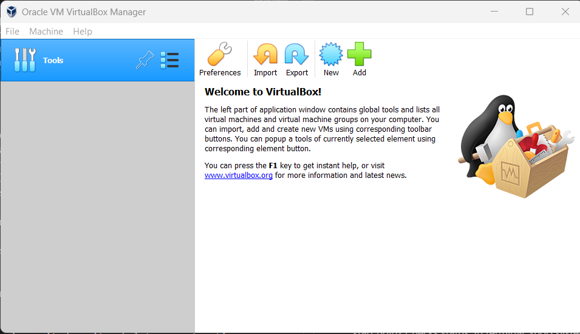
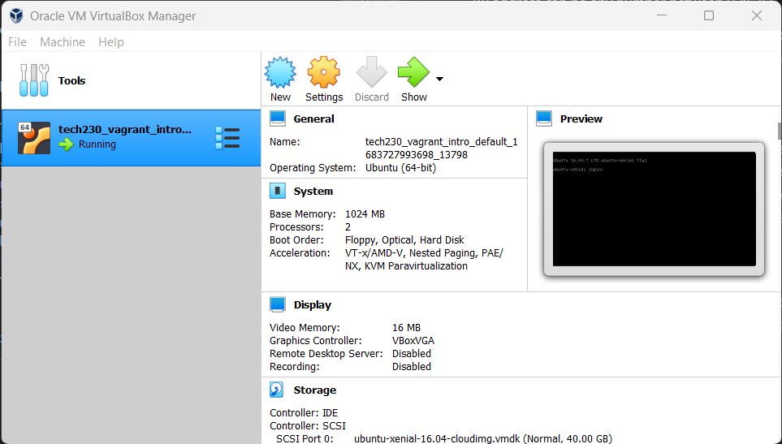

# Nginx deployment using Vagrant

## Steps

### Installation of required software

1. Ensure [Vagrant](https://developer.hashicorp.com/vagrant/downloads?product_intent=vagrant) (download the AMD64 or I686 depending on your CPU type. If in doubt go AMD64) and [Oracle VM VirtualBox](https://www.virtualbox.org/wiki/Download_Old_Builds_6_1) are both installed on your device. To verify Vagrant installed correctly open your terminal and enter `vagrant` and a list of information should be returned.

### Creating a Virtual Machine

2. Open VirtualBox. 
3. Open terminal (git bash) and set folder destination for Virtual Machine using the change directory command that looks something like this: `cd Documents\...\filepath`(Note: you may enclose your file path with "" if there are spaces in your folder names. And you must ensure the path does not begin with a slash.), otherwise use current working directory.
4. Create base file instructions for the Virtual Machine with Vagrant by entering `vagrant init` in the terminal.
5. Open the 'Vagrant' file that has been created in the file path specified. Remove comments. Change "base" to the name of your desired Operating System. Add an IP. Save. Your Vagrant file should have the following/similar in it:
~~~
Vagrant.configure("2") do |config|

  config.vm.box = "ubuntu/xenial64"
  config.vm.network "private_network", ip:"192.168.10.100"

end
~~~
(IP address can be any number between 0 & 255, range goes from 0.0.0.0 to 255.255.255.255).

6. Create/Activate/Run the Virtual Machine that your Vagrant file specifies by entering `vagrant up` in terminal. You should be able to see the running Virtual Machine in VirtualBox. (Note: If at any point you make changes in your Vagrant file that you want implemented, exit the VM and enter `vagrant reload` in your bash terminal. This command shuts down and restarts VM with added instructions/features in Vagrant file.) 
7. To enter the running Virtual Machine, use an SSH key by entering `vagrant ssh` in terminal. Now you are inside your Virtual Machine and your terminal should have the following in your bash terminal: `vagrant@ubuntu-xenial:~$`. (username: vagrant@ubuntu-xenial) (Note:`vagrant ssh` can be used to enter the VM again after it has been exited by using `Ctrl + C` or `exit` in terminal.)

### Deploying basic html server using Nginx

8. In terminal enter `sudo apt-get update` to get packages available to be updated. Ensure that it is done; the terminal should return all actions and end with the word "Done".
9. In terminal enter `sudo apt-get upgrade -y` installs packages from the update command. Let it run until complete.
10. Install Nginx web server on your Virtual Machine by entering `sudo apt-get install nginx -y` in your terminal. Allow it to run until completion. Ensure the following is returned somewhere in terminal "Active: active (running)". (Note: You may need to hit `q` to return to a terminal you can type in once this finishes.)
11. Start program to get a web browser by entering `sudo systemctl start nginx` in terminal. You may use `sudo systemctl status nginx` in terminal to check the status of Nginx.
12. Now you can go to the IP address (in this case: 192.168.10.100) on your web browser & it will show you your deployed web server.
13. To remove your VM enter `vagrant destroy -y` after exiting the VM terminal in your terminal.

## Glossary

`cd` = change directory

`init` =  initialize

`sudo` = "super user do", gives admin rights for this specific command

`apt` = package manager in Linux (`apt-get` = instructions for package manager)

`update` = gets updates, but doesn't put them into effect

`upgrade` = puts updates into effect (all latest versions)

`-y` = flag for permission to say 'yes', so it doesn't ask later (~ automation of permission)

`install` = installs something that is listed after the command

`q` = quit, after executing an installation/upgrade returns to part of VM terminal where you can type further

Ctrl + C = kicks out of VM and returns you to terminal

`exit` = logs out of VM and returns you to the terminal

To zoom in/out Ctrl + scroll or Ctrl + + or Ctrl + -.